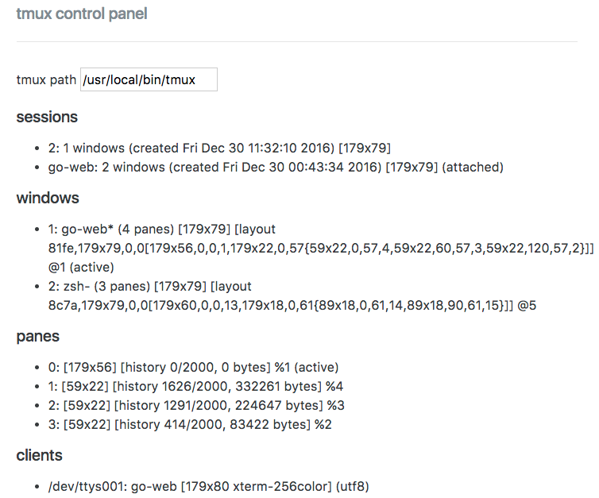

# Tony's sample golang app

Same golang web application for [*The Tao of tmux and Terminal Tricks*](https://leanpub.com/the-tao-of-tmux/read).

# Features

* [`Makefile`](https://en.wikipedia.org/wiki/Makefile) with [file watching functionality from the
  book](https://leanpub.com/the-tao-of-tmux/read#leanpub-auto-file-watching)

  * `make build` - generate game app
  * `make watch_build` - rebuild build application on code file change
  * `make run` - launch server
  * `make watch_run` launch server and restart on file change

    

* Load project with [tmuxp](https://tmuxp.git-pull.com) via `$ tmuxp load .` in
  the project directory. See [`.tmuxp.yaml`](.tmuxp.yaml)

## Installation

```bash
go get -u github.com/tony/tot-go-webapp
```
